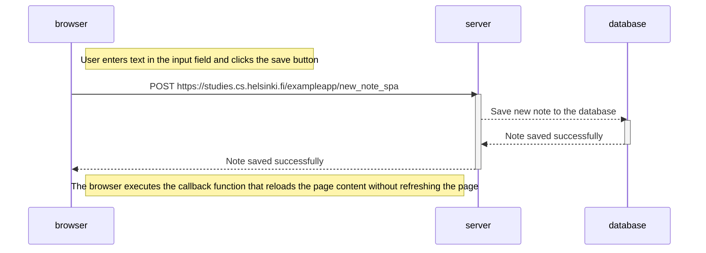

```mermaid
sequenceDiagram
    participant browser
    participant server
    participant database
    
    Note right of browser: User enters text in the input field and clicks the save button
    
    browser->>server: POST https://studies.cs.helsinki.fi/exampleapp/new_note_spa
    activate server
    server-->>database: Save new note to the database
    activate database
    database-->>server: Note saved successfully
    deactivate database
    server-->>browser: Note saved successfully
    deactivate server 

    Note right of browser: The browser executes the callback function that reloads the page content without refreshing the page

```